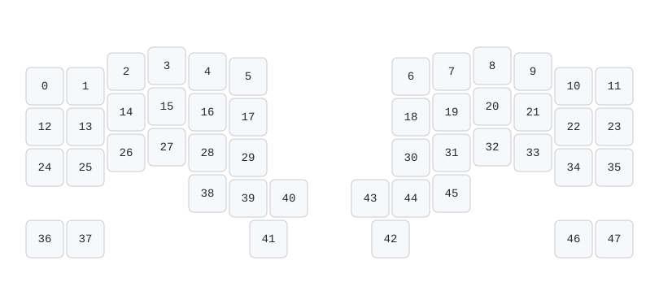
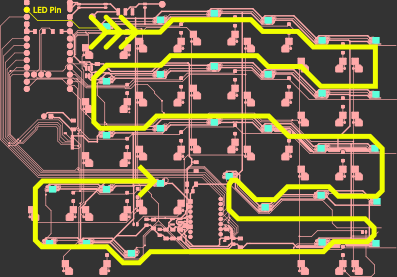
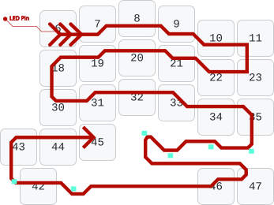

# ZMK RGB Matrix


<table><tbody>
<tr>
<th><center>reactive-gradient</center></th>
<th><center>rainbow-pinwheel</center></th>
<th><center>starlight-smooth</center></th></tr>
<tr>
<td></td>
<td></td>
<td></td>
</tr>
</tbody></table>

An extensible, position-aware / per-key LED RGB matrix framework for ZMK, with
split support and indicator overlays. This module is developed against ZMK
`main` and Zephyr 4.1. See [Built-in effects](#built-in-effects) for more
previews of everything it ships with.

## Installation

Add the repository to the `config/west.yml` in a ZMK config repository:

```yaml
manifest:
  remotes:
    - name: gudzpoz
      url-base: https://github.com/gudzpoz
  projects:
    - name: zmk-rgb-matrix
      remote: gudzpoz
      revision: main
```

## Usage

For the RGB matrix to work, you will need to provide (1) the positions of the
LEDs and (2) configuratinos for the actual lighting effects. Specifying LED
positions can be particularly tricky, but nevertheless, necessary, so bear with
me as we walk through it.

### LED position definitions

First, please follow the official ZMK guide to define for your keyboard:

- [a `zmk,physical-layout`, describing key positions with its `keys`
  property](https://zmk.dev/docs/hardware-integration/physical-layouts#optional-keys-property)

- and [your LED strip
  hardware](https://zmk.dev/docs/hardware-integration/lighting/underglow), but
  make sure to leave out the `zmk,underglow = &led_strip;` step: we'll be using
  our position-aware `keypaw,rgb-matrix` instead of the built-in
  `zmk,underglow`.

Now, as you probably know, your addressable LEDs are chained together, and the
order that they're chained are not always the same as that of your physical
keys. And that is why, in addition to specifying your physical layout and LED
strip, you now need to define that exact order for the RGB matrix with the
`mapping` attribute:

```dts
#include <dt-bindings/keypaw/rgb_matrix.h>

/ {
    rgb_matrix: rgb-matrix {
        compatible = "keypaw,rgb-matrix";
        strip = <&led_strip>;
        physical-layout = <&default_layout>;
        mapping = <0 1 2 KP_RGB_NO_KEY(350, 50)>;
    };
};
```

> The `&led_strip` and `&default_layout` in the config should match what you've
> previously defined. For example, if you are following the official guide like this:
>
> ```dts
> / {
>     physical_layout0: physical_layout_0 {
>         compatible = "zmk,physical-layout";
>         display-name = "Default Layout";
>     };
> };
> ```
>
> Then you should be using `&physical_layout0` instead of `&default_layout`.

Each entry in this `mapping = <0 1 2 KP_RGB_NO_KEY(350, 50)>;` thing specifies
the position of an LED: an integer `N` means a per-key LED under the `N`-th key
(`0` means that LED is under the key represented by the first
`&key_physical_attrs` entry in your physical layout, while `5` means the sixth
entry). The mapping length must match the strip's `chain-length`.

> Use `KP_RGB_NO_KEY(x, y)` for an LED that is not directly underneath a key;
> coordinates use the layout's units (`100` is one key width, similar to
> `&key_physical_attrs`).

Confused? Let's break it down. First, I recommend using [ZMK physical layout
converter](https://zmk-physical-layout-converter.streamlit.app/) to visualize
your actual key ordering: open the page, paste in your ZMK layout in the "ZMK
DTS" panel and click "Update JSON using this", after which you should see a
visualization with your keys numbered:



Now, bring out your PCB design and trace through your LED chain. Then (maybe
mentally) overlay the chain on your keyboard layout, and that is what you need
for your RGB matrix `mapping`. For example, the following PCB and keyboard
layout give <code>mapping = &lt;6 7 8 9 10 11 &nbsp;&nbsp; 23 22 21 20 19 18
&nbsp;&nbsp; 30 31 32 33 34 35 ...&gt;;</code>.

<table><tbody>
<tr><td></td>
<td>→</td>
<td></td></tr>
</tbody></table>

> The example above also has a few LEDs with no corresponding keys, for which you will need to calculate the coordinates yourself.
> Here is the full mapping for the example:
> ```
> / {
>     rgb_matrix: rgb-matrix {
>         compatible = "keypaw,rgb-matrix";
>         strip = <&led_strip>;
>         physical-layout = <&default_layout>;
>
>         mapping = <
>         6 7 8 9 10 11
>         23 22 21 20 19 18
>         30 31 32 33 34 35
>
>         KP_RGB_NO_KEY(1450, 387) // between 35 & 47
>         KP_RGB_NO_KEY(1350, 387) // between 34 & 46
>         KP_RGB_NO_KEY(1250, 400) // ~to the left of the previous LED
>         KP_RGB_NO_KEY(1180, 350) // ~to the top left of the previous LED
>         47 46
>         KP_RGB_NO_KEY(1000, 500) // ~to the right of 42
>         42
>         KP_RGB_NO_KEY(850, 475)  // ~to the left of 42
>         43 44 45
>         >;
>     };
> };
> ```
>
> A split keyboard normally declares one matrix node and one local mapping on
> each half. See my ZMK config for a rather complex example: [`rgb_matrix` for
> the left
> half](https://github.com/gudzpoz/keypaw48-zmk/blob/main/boards/shields/keypaw48/keypaw48_left.overlay),
> [`rgb_matrix` for the right
> half](https://github.com/gudzpoz/keypaw48-zmk/blob/main/boards/shields/keypaw48/keypaw48_right.overlay)
> and [the `physical_layout` they map
> to](https://github.com/gudzpoz/keypaw48-zmk/blob/main/boards/shields/keypaw48/keypaw48-layouts.dtsi).

### Effect configurations

With the LEDs specified, you can now configure your RGB effects. Basically, you
need a `keypaw,behavior-rgb-matrix` devicetree node, with the effects you want
as its children:

```dts
/ {
    behaviors {
        kprgb: kprgb {
            compatible = "keypaw,behavior-rgb-matrix";
            #binding-cells = <2>;
            initial-effect = <0>;

            fx_breathe: fx_breathe {
                compatible = "keypaw,rgb-matrix-breathe";
                #binding-cells = <0>;
                color = <0x0000FF>;
                duration = <2400>;
            };
            fx_rainbow: fx_rainbow {
                compatible = "keypaw,rgb-matrix-rainbow";
                #binding-cells = <0>;
                color = <0xFFFFFF>;
                duration = <4000>;
                basis = "x";
                direction = "out";
                palette = "rainbow";
            };
            fx_heatmap: fx_heatmap {
                compatible = "keypaw,rgb-matrix-heatmap";
                #binding-cells = <0>;
                color = <0xFFFFFF>;
                decrease-delay-ms = <25>;
                spread = <150>;
                area-limit = <16>;
                increase-step = <32>;
            };
        };
    };
};
```

> For split builds, you need to make sure that boards get the same effect
> definitions: an effect is identified by its position in the registry, so a
> different set or order desyncs the halves. The same also applies to overlays
> (see below).

### Optional overlay configurations

Optionally, you may also specify some LED overlays to indicate CapsLock or the
current active layer, for example. An overlay is a **compositor**: it renders
one effect while a **condition** is active, and blends the result over the LEDs
it targets.

```dts
/ {
    rgb_conditions: rgb_conditions {
        compatible = "keypaw,rgb-conditions";
        // Host CapsLock state
        cond_caps: cond_caps {
            compatible = "keypaw,rgb-condition-caps-lock";
        };
        // Layer 1 active state
        cond_layer1: cond_layer1 {
            compatible = "keypaw,rgb-condition-layer";
            layer = <1>;
        };
    };

    rgb_overlays: rgb_overlays {
        compatible = "keypaw,rgb-overlays";
        // Light up Key No. 41 when CapsLock is active
        caps: caps {
            compatible = "keypaw,rgb-overlay";
            condition = <&cond_caps>;
            keys = <41>;
            fx_caps {
                compatible = "keypaw,rgb-matrix-solid";
                #binding-cells = <0>;
                color = <0x00FFFF>;
            };
        };
        // Light up keys when Layer 1 is active
        layer_fn1: layer_fn1 {
            compatible = "keypaw,rgb-overlay";
            condition = <&cond_layer1>;
            keys = <13 14 15 16 17 18 19 20 21 22>;
            fx_fn1 {
                compatible = "keypaw,rgb-matrix-solid";
                #binding-cells = <0>;
                color = <0xFF8000>;
            };
        };
    };

    behaviors {
        kprgb: kprgb {
            compatible = "keypaw,behavior-rgb-matrix";
            #binding-cells = <2>;
            overlays = <&caps &layer_fn1>;
            // ...
        };
    };
};
```

An overlay composites exactly **one** effect, given either way:

- a nested child (as above) is a **private preset**: it consumes no registry slot,
  cannot be cycled into, and does not follow the user's brightness/hue changes;
- `effect = <&fx_solid>;` names a **shared registry effect** (a child of `&kprgb`),
  which is live and adjustable.

Use one or the other, never both. `opacity` (default 100) blends the composited
result over the underlying pixels instead of replacing them; `all-leds;` targets
every LED on the half instead of a `keys`/`leds` list, and at `opacity` 100 it
replaces the frame outright, so the engine then skips rendering the active effect
and any overlay below it, since none of them can be seen.

By default the condition is evaluated **once on the central** and the resulting
on/off bit is pushed to the peripherals, so a layer or CapsLock overlay needs
nothing extra. Add **`local;`** only when each half should evaluate the condition
for itself — that is what makes each half show its *own* state (a battery bar,
per-half activity):

```dts
battery: battery {
    compatible = "keypaw,rgb-overlay";
    condition = <&cond_battery>;
    local;                       /* each half reads its own charge */
    keys = <...>;
};
```

`keypaw,rgb-conditions` and `keypaw,rgb-overlays` are plain container nodes;
neither belongs under `&kprgb`, whose children are the effect registry. List the
overlays in paint order on the owning behavior node like `overlays = <&caps
&layer_fn1>;` in the example above; an effect may override that list with its
own `overlays`/`no-overlays`.

### Controlling the RGB matrix

The `keypaw,behavior-rgb-matrix` (`&kprgb`) behavior defined above can be used
to control the RGB engine, allowing you to adjust the current color, switch
between effects and turn the LEDs on and off. See [RGB Underglow
Behavior](https://zmk.dev/docs/keymaps/behaviors/underglow) in ZMK documentation
for details: just replace their `&rgb_ug` with your `&kprgb`.

```dts
bindings = <
    &kprgb RGB_TOG &fx_solid &fx_reactive
    &kprgb RGB_BRI &kprgb RGB_BRD
>;
```

Effect state is persisted when `CONFIG_SETTINGS=y`; otherwise the configured
initial state is used at boot. The matrix turns off on idle by default;
`CONFIG_KEYPAW_RGB_MATRIX_AUTO_OFF_IDLE=n` keeps it lit and applies
`idle-brightness` while idle.

## Built-in components

This ZMK module is designed to be extensible: you can implement effects and
conditions in your own custom module without having to modify code in this
module. Overlays and triggers are configured entirely in devicetree from those.
We also aim to provide a good out-of-the-box experience with a number of
built-in effects, overlays and conditions, which you can just use without having
to touch any C code.

### Built-in effects

These effects are grouped by rendering/state family: static fields (`solid`,
`static`), global oscillators (`breathe`, `spectrum`), moving spatial fields
(`rainbow`, `band`), reactive effects (`reactive`, `ripple`), and stochastic
effects (`rain`, `starlight`, `heatmap`, `digital_rain`). The attributes below
select behavior within a compatible; they do not imply unimplemented QMK modes.

Every animation below is rendered from ZMK's `native_sim//zmk_test_mock` "board"
by the [preview harness](tests/sim). The label in front of each animation, and
the effect name in its row, link to the [gallery
site](https://gudzpoz.github.io/zmk-rgb-matrix/), where each variant sits next
to the devicetree node that produces it.

<!-- No GIFs inside links: GitHub hides them for people with Accessibility.Motion = Disabled -->

<table>
<thead><tr><th>Effect</th><th>Description</th><th>Attributes</th></tr></thead>
<tbody>
<tr><td><code><a href="https://gudzpoz.github.io/zmk-rgb-matrix/#solid">solid</a></code></td>
    <td>One flat colour across every LED, or a static hue gradient swept across the board.</td>
    <td><code>axis</code> = <code>none</code> (flat colour) |
        <code>vertical</code> (hue sweep across y) |
        <code>horizontal</code> (hue sweep across x)</td></tr>
<tr><td colspan="3">
<a href="https://gudzpoz.github.io/zmk-rgb-matrix/#solid">default</a>: <br>
<a href="https://gudzpoz.github.io/zmk-rgb-matrix/#solid-vertical">vertical</a>: <br>
<a href="https://gudzpoz.github.io/zmk-rgb-matrix/#solid-horizontal">horizontal</a>: 
</td></tr>
<tr><td><code><a href="https://gudzpoz.github.io/zmk-rgb-matrix/#breathe">breathe</a></code></td>
    <td>Board-wide fade or a position-aware oscillator over one period.</td>
    <td><code>mode</code> = <code>brightness</code> (BREATHING) |
        <code>river</code> (RIVERFLOW) | <code>hue</code> (HUE_BREATHING) |
        <code>pendulum</code> (HUE_PENDULUM) | <code>wave</code> (HUE_WAVE)<br>
        <code>hue-amplitude</code> (hue swing in degrees for the hue modes, default 45)</td></tr>
<tr><td colspan="3">
<a href="https://gudzpoz.github.io/zmk-rgb-matrix/#breathe-brightness">brightness</a>: <br>
<a href="https://gudzpoz.github.io/zmk-rgb-matrix/#breathe-river">river</a>: <br>
<a href="https://gudzpoz.github.io/zmk-rgb-matrix/#breathe-hue">hue</a>: <br>
<a href="https://gudzpoz.github.io/zmk-rgb-matrix/#breathe-pendulum">pendulum</a>: <br>
<a href="https://gudzpoz.github.io/zmk-rgb-matrix/#breathe-wave">wave</a>: 
</td></tr>
<tr><td><code><a href="https://gudzpoz.github.io/zmk-rgb-matrix/#spectrum">spectrum</a></code></td>
    <td>Whole board cycles the hue wheel globally (QMK <code>CYCLE_ALL</code>).</td>
    <td>&mdash;</td></tr>
<tr><td colspan="3">
<a href="https://gudzpoz.github.io/zmk-rgb-matrix/#spectrum">default</a>: 
</td></tr>
<tr><td><code><a href="https://gudzpoz.github.io/zmk-rgb-matrix/#reactive">reactive</a></code></td>
    <td>Lights a pressed key and fades it back; the lit shape is configurable.</td>
    <td><code>spread</code> = <code>point</code> (key only) |
        <code>disc</code> (filled circle) | <code>cross</code> (row + column) |
        <code>nexus</code> (all but the cross, radial falloff)<br>
        <code>spread-radius</code> (disc/nexus radius, in layout units; for nexus it is the band width measured outward from the excluded cross)<br>
        <code>background-brightness</code> (unlit-LED brightness, percent)<br>
        <code>multi</code> (accumulate several presses instead of the latest)<br>
        <code>palette</code> = <code>solid</code> (user hue) |
        <code>gradient</code> (position-based hue) |
        <code>complement</code> (unlit floor keeps the hue, a pressed key flashes the opposite hue)</td></tr>
<tr><td colspan="3">
<a href="https://gudzpoz.github.io/zmk-rgb-matrix/#reactive-point">point</a>: <br>
<a href="https://gudzpoz.github.io/zmk-rgb-matrix/#reactive-disc">disc</a>: <br>
<a href="https://gudzpoz.github.io/zmk-rgb-matrix/#reactive-cross">cross</a>: <br>
<a href="https://gudzpoz.github.io/zmk-rgb-matrix/#reactive-nexus">nexus</a>: <br>
<a href="https://gudzpoz.github.io/zmk-rgb-matrix/#reactive-gradient">gradient</a>: <br>
<a href="https://gudzpoz.github.io/zmk-rgb-matrix/#reactive-complement">complement</a>: <br>
<a href="https://gudzpoz.github.io/zmk-rgb-matrix/#reactive-multi">multi</a>: 
</td></tr>
<tr><td><code><a href="https://gudzpoz.github.io/zmk-rgb-matrix/#ripple">ripple</a></code></td>
    <td>Radial ripples expand from each pressed key over an unlit background.</td>
    <td><code>background-brightness</code> (unlit background brightness, percent)</td></tr>
<tr><td colspan="3">
<a href="https://gudzpoz.github.io/zmk-rgb-matrix/#ripple">default</a>: 
</td></tr>
<tr><td><code><a href="https://gudzpoz.github.io/zmk-rgb-matrix/#rainbow">rainbow</a></code></td>
    <td>Position-aware rainbow gradient with selectable spatial basis and direction.</td>
    <td><code>basis</code> = <code>x</code> | <code>y</code> | <code>radial</code> |
        <code>pinwheel</code> | <code>spiral</code> | <code>chevron</code> |
        <code>flag</code>
        (spatial coordinate the colour maps onto; <code>flag</code> is a
        left-right sweep skewed per row so it undulates)<br>
        <code>direction</code> = <code>out</code> | <code>in</code> (reverse) |
        <code>dual</code> (two centres) | <code>bloom</code> (mirror each half, with basis x)<br>
        <code>palette</code> = <code>rainbow</code> (full hue wheel) |
        <code>solid</code> (single hue, travelling brightness band)</td></tr>
<tr><td colspan="3">
<a href="https://gudzpoz.github.io/zmk-rgb-matrix/#rainbow-x">x</a>: <br>
<a href="https://gudzpoz.github.io/zmk-rgb-matrix/#rainbow-y">y</a>: <br>
<a href="https://gudzpoz.github.io/zmk-rgb-matrix/#rainbow-radial">radial</a>: <br>
<a href="https://gudzpoz.github.io/zmk-rgb-matrix/#rainbow-pinwheel">pinwheel</a>: <br>
<a href="https://gudzpoz.github.io/zmk-rgb-matrix/#rainbow-spiral">spiral</a>: <br>
<a href="https://gudzpoz.github.io/zmk-rgb-matrix/#rainbow-chevron">chevron</a>: <br>
<a href="https://gudzpoz.github.io/zmk-rgb-matrix/#rainbow-flag">flag</a>: <br>
<a href="https://gudzpoz.github.io/zmk-rgb-matrix/#rainbow-in">in</a>: <br>
<a href="https://gudzpoz.github.io/zmk-rgb-matrix/#rainbow-dual">dual</a>: <br>
<a href="https://gudzpoz.github.io/zmk-rgb-matrix/#rainbow-bloom">bloom</a>: <br>
<a href="https://gudzpoz.github.io/zmk-rgb-matrix/#rainbow-solid">solid</a>: 
</td></tr>
<tr><td><code><a href="https://gudzpoz.github.io/zmk-rgb-matrix/#band">band</a></code></td>
    <td>A single-hue board with a moving saturation or brightness band.</td>
    <td><code>channel</code> = <code>sat</code> (fades saturation) |
        <code>val</code> (fades brightness)<br>
        <code>shape</code> = <code>linear</code> (scroll) |
        <code>pinwheel</code> (rotate) | <code>spiral</code> (wind outward)</td></tr>
<tr><td colspan="3">
<a href="https://gudzpoz.github.io/zmk-rgb-matrix/#band-saturation-linear">saturation, linear</a>: <br>
<a href="https://gudzpoz.github.io/zmk-rgb-matrix/#band-saturation-pinwheel">saturation, pinwheel</a>: <br>
<a href="https://gudzpoz.github.io/zmk-rgb-matrix/#band-saturation-spiral">saturation, spiral</a>: <br>
<a href="https://gudzpoz.github.io/zmk-rgb-matrix/#band-value-linear">value, linear</a>: 
</td></tr>
<tr><td><code><a href="https://gudzpoz.github.io/zmk-rgb-matrix/#static">static</a></code></td>
    <td>Fixed per-LED colour map (QMK <code>ALPHAS_MODS</code> and similar art); each LED
        takes a colour from the <code>led-colors</code> array.</td>
    <td><code>led-colors</code> (RGB values, one per LED by chain index; LEDs past the end stay off)</td></tr>
<tr><td colspan="3">
<a href="https://gudzpoz.github.io/zmk-rgb-matrix/#static">default</a>: 
</td></tr>
<tr><td><code><a href="https://gudzpoz.github.io/zmk-rgb-matrix/#rain">rain</a></code></td>
    <td>Randomly lit keys with random colours (QMK <code>PIXEL_RAIN</code>, <code>PIXEL_FLOW</code>,
        <code>RAINDROPS</code>, <code>JELLYBEAN_RAINDROPS</code>, <code>PIXEL_FRACTAL</code>).</td>
    <td><code>mode</code> = <code>pixel</code> (random keys, random hues) |
        <code>drops</code> (nudges one random key's hue each step; the board stays lit, so it needs a saturated colour) |
        <code>jellybean</code> (also randomises saturation) |
        <code>flow</code> (cursor along chain) |
        <code>fractal</code> (single hue pulses from centre)</td></tr>
<tr><td colspan="3">
<a href="https://gudzpoz.github.io/zmk-rgb-matrix/#rain-pixel">pixel</a>: <br>
<a href="https://gudzpoz.github.io/zmk-rgb-matrix/#rain-flow">flow</a>: <br>
<a href="https://gudzpoz.github.io/zmk-rgb-matrix/#rain-drops">drops</a>: <br>
<a href="https://gudzpoz.github.io/zmk-rgb-matrix/#rain-jellybean">jellybean</a>: <br>
<a href="https://gudzpoz.github.io/zmk-rgb-matrix/#rain-fractal">fractal</a>: 
</td></tr>
<tr><td><code><a href="https://gudzpoz.github.io/zmk-rgb-matrix/#starlight">starlight</a></code></td>
    <td>LEDs turn on and off at random at varying brightness, keeping the user colour.</td>
    <td><code>smooth</code> (ramp brightness instead of switching) |
        <code>dual-hue</code> (jitter hue &plusmn;30) |
        <code>dual-sat</code> (jitter saturation &plusmn;30)</td></tr>
<tr><td colspan="3">
<a href="https://gudzpoz.github.io/zmk-rgb-matrix/#starlight">default</a>: <br>
<a href="https://gudzpoz.github.io/zmk-rgb-matrix/#starlight-smooth">smooth</a>: <br>
<a href="https://gudzpoz.github.io/zmk-rgb-matrix/#starlight-dual-hue">dual hue</a>: <br>
<a href="https://gudzpoz.github.io/zmk-rgb-matrix/#starlight-dual-sat">dual sat</a>: 
</td></tr>
<tr><td><code><a href="https://gudzpoz.github.io/zmk-rgb-matrix/#heatmap">heatmap</a></code></td>
    <td>Per-key heat map of recent keypresses, decaying over time (QMK <code>TYPING_HEATMAP</code>).</td>
    <td><code>decrease-delay-ms</code> (ms idle before one shade of heat is lost)<br>
        <code>spread</code> (radius heating neighbours, layout units)<br>
        <code>area-limit</code> (per-press cap on heat a neighbour receives)<br>
        <code>increase-step</code> (shades added per keypress)<br>
        <code>slim</code> (heat only the pressed key, not neighbours)</td></tr>
<tr><td colspan="3">
<a href="https://gudzpoz.github.io/zmk-rgb-matrix/#heatmap">default</a>: <br>
<a href="https://gudzpoz.github.io/zmk-rgb-matrix/#heatmap-slim">slim</a>: 
</td></tr>
<tr><td><code><a href="https://gudzpoz.github.io/zmk-rgb-matrix/#digital-rain">digital_rain</a></code></td>
    <td>Matrix-style falling columns: a head falls per column leaving a fading green tail.</td>
    <td><code>color</code> (tail hue; green default) |
        <code>duration</code> (fall speed; shorter is faster)</td></tr>
<tr><td colspan="3">
<a href="https://gudzpoz.github.io/zmk-rgb-matrix/#digital-rain">default</a>: 
</td></tr>
</tbody>
</table>

Every effect accepts `color`, `duration`, `overlays`, `no-overlays`, and
`no-cycle` attributes (though some attributes might be meaningless to some
effects).

QMK's beacon pair needs no dedicated variant: `RAINBOW_BEACON` is `rainbow`
with `basis=pinwheel` and `palette=rainbow`, and `DUAL_BEACON` is the same
with `palette=solid` and `direction=dual`.

## Custom effects and conditions

Third-party modules can add effects and conditions without editing this module;
overlays and triggers are then configured in devicetree from them. The full
authoring guide is [`docs/extending.md`](./docs/extending.md); module internals
are documented in [`docs/development.md`](./docs/development.md).

As a quick taste, a third-party effect module includes the public API as
`<zmk/rgb_matrix.h>`, provides a binding that includes
`keypaw,rgb-matrix-effect-common.yaml`, embeds
`struct kp_rgb_effect_common_config` and `struct kp_rgb_effect_common_data` as
the first member of the effect's config and data structures, and instantiates
each enabled devicetree node with `KP_RGB_EFFECT_DEFINE()`.

`modules/zmk-rgb-effect-example` in the parent
[`keypaw48-zmk`](https://github.com/gudzpoz/keypaw48-zmk/tree/main/modules/zmk-rgb-effect-example)
repository is a complete separate-module example. It demonstrates the required
binding, data layout, renderer, and `&kprgb` child node without using internal
matrix headers.

## License

MIT. See [LICENSE](./LICENSE).
